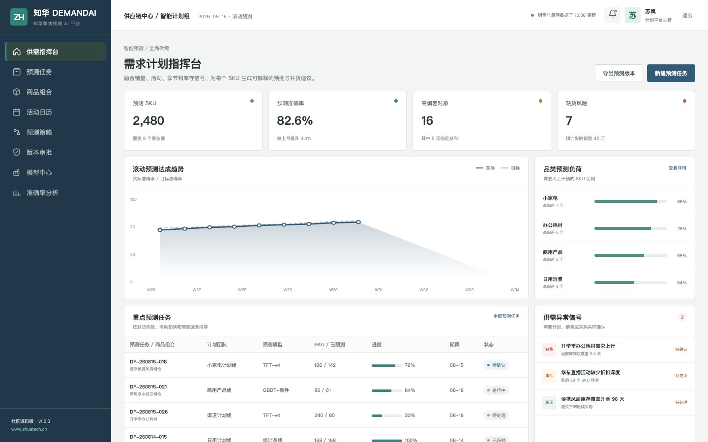
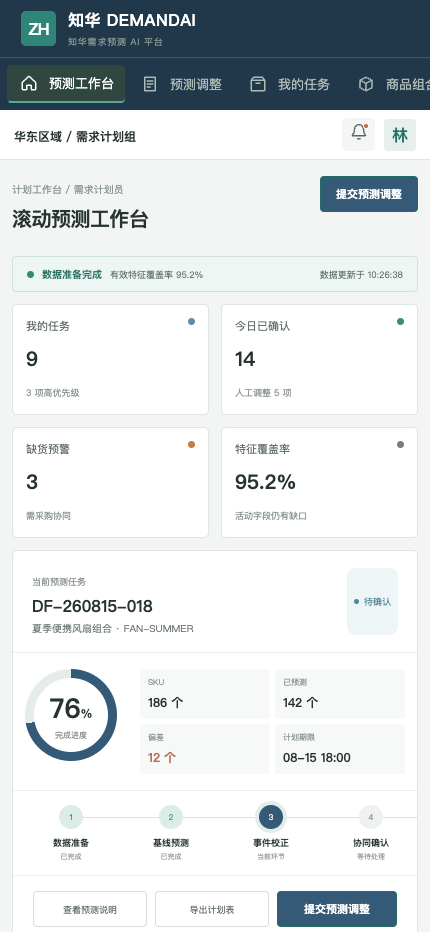

<div align="center">

# ZhuaTech DemandAI

### 知华需求预测 AI 平台 · 社区源码版

把销量、活动、季节和库存信号，变成可解释的滚动预测与补货建议。

**[知华科技官网](https://www.zhuatech.cn/)** · 上海如静知华信息科技有限公司

</div>

> [!IMPORTANT]
> 本工程仅限个人非商业学习、研究和技术交流，不得商用。企业内部部署、生产使用、SaaS、客户交付、收费咨询、品牌替换和商业再发行，均须事先取得上海如静知华信息科技有限公司书面授权。详见 [LICENSE](LICENSE)。

## 从预测数字到执行动作

ZhuaTech DemandAI 面向需求计划、销售运营、采购与库存团队，保留“模型基线—业务事件—人工调整—发布执行—准确率复盘”的完整链路。它不是自动下采购单的黑盒，而是一套带置信度、驱动因素和发布门禁的计划协同样例。

```text
销量 / 活动 / 季节 / 库存
            ↓
        基线预测
            ↓
  事件校正 + 安全库存计算
            ↓
     人工确认 → 补货建议 → 效果复盘
```

## 页面实录



管理端展示预测准确率、高偏差 SKU、缺货风险、品类负荷和等待确认的业务调整。



H5 工作台让计划员查看负责品类、活动事件、预测差异和补货信号，并提交人工调整依据。

## 已实现能力

- 商品、区域、渠道与预测层级管理
- 历史均值、近期趋势、季节因子和促销提升组合预测
- 安全库存、建议补货量和 `REPLENISH / HOLD / REDUCE` 信号
- 多周期预测回测，计算 WAPE、系统偏差、最差周期与版本发布门禁
- 模型基线与人工调整版本并行保存
- 预测任务、版本审批、活动日历和准确率分析
- JWT 权限、MySQL 迁移、Docker Compose 与响应式双端

参考接口：`POST /api/ai/demand/forecast`、`POST /api/ai/demand/backtest`。默认策略完全本地运行，不需要 API Key，便于个人理解需求预测和供应链计划工程边界。

## 工程信息

- 后端：Java 21、Spring Boot 4、JPA、Flyway、MySQL 8
- 前端：Vue 3、Pinia、Vue Router、Axios、Vite
- Java 包：`cn.zhuatech.demandai`
- 测试：JUnit 5、MockMvc、H2
- 文档：[API](docs/api.md) · [架构](docs/architecture.md) · [数据库](docs/database.md) · [部署](deploy/README.md)

```bash
cd frontend
npm install
npm run dev:demo
```

浏览器访问 `http://localhost:5173`，管理端 `planner / Demo@2026`，计划员端 `operator / Demo@2026`。演示商品、销量和金额均为虚构数据。

## 定制与联系

需要需求预测、供应链计划、ERP/WMS/OMS 集成、AI 私有化或软件项目外包，请联系[知华科技](https://www.zhuatech.cn/)：

| 需求预测咨询 | 项目合作咨询 |
| --- | --- |
|  |  |

SEO：AI 需求预测、销量预测、智能补货、供应链 AI、Java 需求预测源码、Demand Forecasting、知华科技。
